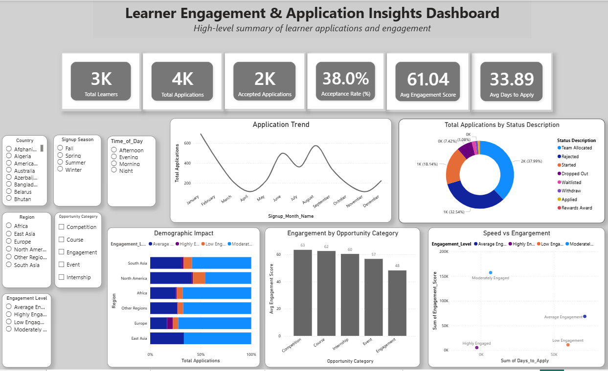
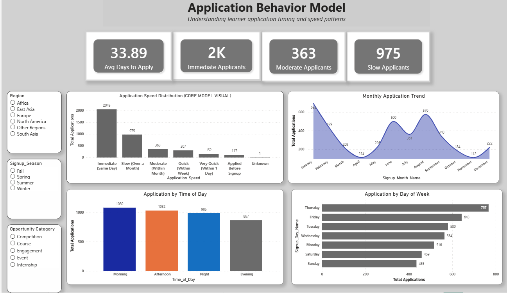
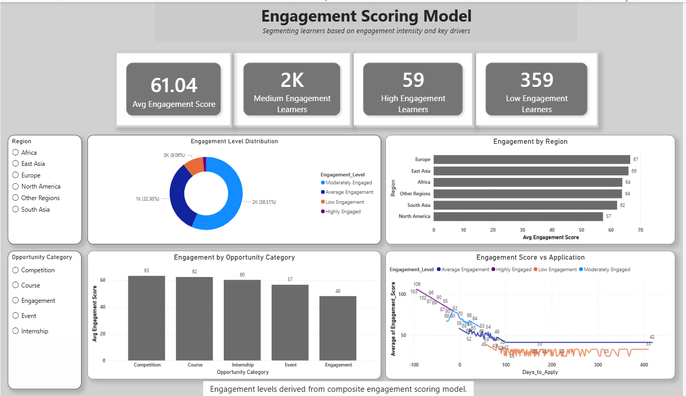
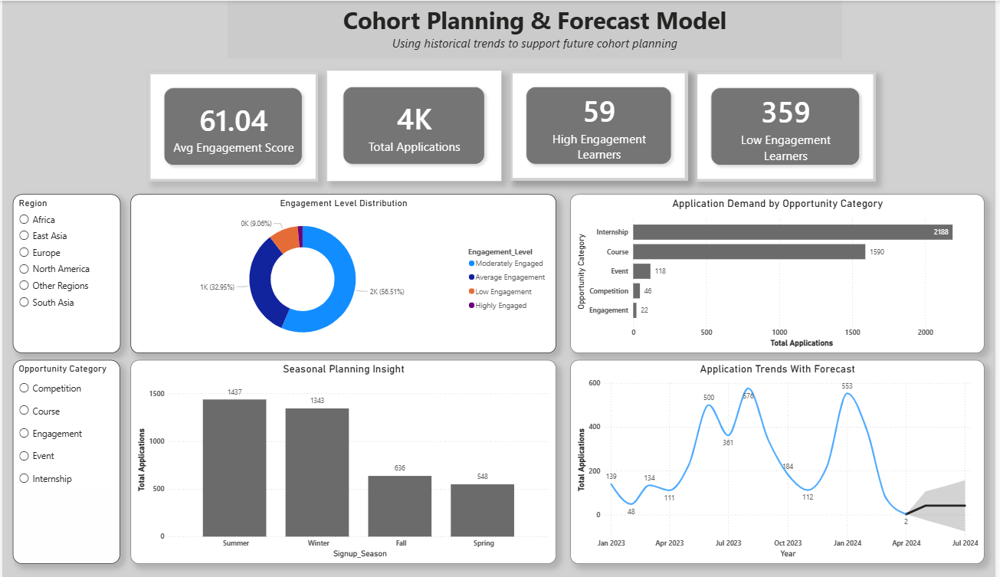

# Learner Engagement, Completion & Cohort Planning Analysis

## 📌 Project Overview
This project explores learner signup behavior, application completion patterns, engagement levels, and future cohort demand using Power BI.

The analysis was designed to help stakeholders understand:
- how learner behavior affects completion,
- which factors influence engagement,
- and how historical trends can support future planning.

The final output includes interactive dashboards, behavioral models, engagement scoring, and forecasting insights to support data-driven decision-making.

## 📊 Tool Used
Power BI
Excel / CSV
Basic forecasting features in Power BI
Data cleaning and transformation techniques

## 📁 Dataset
This dataset contains learner participation and application records across multiple opportunities such as courses, internships, and events.

It includes behavioral, temporal, and categorical variables such as:

. Signup date and time
. Opportunity category
. Application timing
. Region
. Status description
. Engagement-related features

Note: Some fields, including age and opportunity date columns, were excluded due to missing values and source-level formatting issues.

## ❓ Problem Statement

Educational and opportunity-based programs often struggle with:

. understanding learner engagement patterns,
. identifying factors that influence application completion,
. and planning future cohorts effectively.

This project was designed to answer the following questions:

. What behavioral patterns influence learner completion?
. How does application timing affect engagement?
. Which learners show stronger engagement signals?
. Can historical trends help forecast future signup demand?

## 🎯 Project Objectives

The main objectives of this analysis were to:

. Analyze learner signup and application behavior
. Measure engagement patterns across users
. Identify factors influencing completion
. Build interactive dashboards for stakeholder decision-making
. Forecast future application volume for cohort planning

## 🔍 Process
1. Data Cleaning
. Removed duplicate records
. Standardized categorical fields
. Handled missing values
. Removed corrupted and empty columns
. Resolved date formatting issues where possible

2. Feature Engineering
Created new analytical features such as:

. Days_to_Apply
. Application_Speed
. Engagement_Score
. Engagement_Level
. Signup_Month
. Signup_Day_Name
. Time_of_Day

3. Dashboard Development
Built a multi-page Power BI dashboard including:

. Overview Dashboard
. Application Behavior Model
. Engagement Scoring Model
. Cohort Planning & Forecast Model

4. Forecasting & Insights
. Applied time-series forecasting to historical signup trends
. Used trend analysis to support proactive planning
. Interpreted behavioral patterns to derive actionable recommendations

## 📈 Key Insights
. Learners who apply earlier tend to show higher engagement levels
. Application speed is a strong indicator of learner commitment
. Completion patterns vary by signup hour, day, and season
. A small portion of users showed extreme delays in application activity
. Historical trends reveal seasonal patterns useful for future cohort planning
. Behavioral indicators were more useful than incomplete demographic data

## 💡 Recommendations
. Target communication during peak signup periods
. Send reminders to delayed applicants
. Prioritize support for low-engagement learners
. Use region-specific engagement strategies
. Monitor signup trends continuously for better cohort planning
. Use forecast insights to support resource allocation

## 📊 Dashboard Pages
1. Overview & Key Metrics
Summarizes learner activity, completion trends, and major KPIs.

2. Application Behavior Model
Examines how quickly learners apply and how timing affects engagement.

3. Engagement Scoring Model
Classifies learners into high, medium, and low engagement groups.

4. Cohort Planning & Forecast Model
Uses historical signup data to forecast future demand

</> Markdown
## 📸 Dashboard Preview
### Overview Dashboard

### Application Behavior Model

### Engagement Scoring Model

### Forecast Dashboard

## 📂 Files Included
. Learner_Engagement_Dashboard.pbix
.pdf)
. Strategic_Insights_Report.pdf
. Pitch_Presentation.pdf
. dashboard_screenshots/
. README.md

## 🚀 Outcome
. This project demonstrates my ability to:
. clean and structure data,
. create interactive dashboards,
. generate business insights,
. and communicate analytical findings clearly for decision-making.

## 👩🏽‍💻 Author
Abigail Alabi
Data Analyst | Power BI | Excel | Data Storytelling

